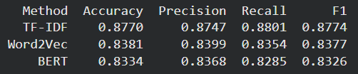

# 🎬 Sentiment Analysis on IMDB Dataset

This project compares three different text-representation techniques — **TF-IDF, Word2Vec, and BERT embeddings** — for sentiment classification on the IMDB movie reviews dataset using Logistic Regression as the classifier.

## 📚 Project Overview

The goal is to evaluate how classical and modern NLP techniques perform on sentiment analysis tasks.
We use:

**TF-IDF** → traditional statistical feature representation

**Word2Vec** → word embeddings capturing semantic meaning

**BERT (DistilBERT)** → transformer-based contextual embeddings

Each representation is trained and evaluated using Logistic Regression, and results are compared using standard classification metrics.

## 🧠 Workflow
### 1️⃣ Load Dataset

The IMDB dataset is used from the datasets library:

from datasets import load_dataset
dataset = load_dataset('imdb')

The dataset is automatically split into train and test sets.

### 2️⃣ Preprocessing

Steps include:

Lowercasing

Removing HTML tags

Removing punctuation and numbers

Tokenization with NLTK

Stopword removal

### 3️⃣ Feature Extraction Methods
🔹 TF-IDF

Represent text as numerical vectors using term frequency–inverse document frequency.

Trained with Logistic Regression.

🔹 Word2Vec

Train a Word2Vec model on tokenized text.

Represent each document as the average of its word vectors.

🔹 BERT (DistilBERT)

Use DistilBERT embeddings for contextual representation.

Extract token embeddings from the last hidden state.

### 4️⃣ Classification

A Logistic Regression classifier is trained on each feature representation.

### 5️⃣ Evaluation Metrics

Evaluate performance using:

Accuracy

Precision

Recall

F1-score

## 📊 Comparison

## 🧩 Technologies Used

Python

PyTorch

Hugging Face Transformers

scikit-learn

NLTK

Gensim

BeautifulSoup

Datasets Library

## 🚀 How to Run

Clone this repository:

git clone https://github.com/imran-sony/sentiment-analysis-imdb.git  
cd sentiment-analysis-imdb  

or open IMDB.ipynb
